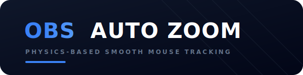

  

<h1 align="center">OBS 自动跟随鼠标缩放脚本 (obs-auto-zoom)</h1>

  
  
  
  

  <b>一款高阶的 OBS 自动缩放与鼠标跟随插件，专为授课、演示、软件教程录制及直播设计。</b>

## 🌟 核心特性

- 🎬 **电影级平滑跟随 (Spring-Damper)**：
  - 引入了二阶阻尼弹簧物理算法，让镜头的运动具有自然的惯性缓冲与回弹，告别生硬死板的线性漂移。
  - 支持在 UI 中实时调整“跟随弹性强度”和“跟随阻尼比”，打造最适合您视线习惯的滑行阻尼。
  - 支持退化为传统的无震荡指数平滑跟随（将弹性强度调至 `0.0` 即可）。

- ⏳ **空闲自动复原 1x**：
  - 当鼠标静止不动达到设定时间（例如 3 秒），镜头会自动极其柔和地拉远并缩回到 1x 比例（显示完整屏幕）。
  - 一旦鼠标再次移动，镜头会迅速平滑地重新拉近聚拢到鼠标位置。

- 🔒 **焦点锁定快捷键**：
  - 随时一键将镜头锁定在当前所在画面区域，允许鼠标移至其他地方进行无关点击，再次按下快捷键恢复跟随。

- 🎡 **动态快捷键变焦**：
  - 无需打开脚本面板，在放大状态下可直接使用快捷键（以 0.5 步长）动态拉近或拉远镜头，镜头伸缩过渡完全平顺。

- 💻 **完美的跨平台与高DPI兼容**：
  - 采用 Lua FFI 技术，深度适配 Windows (`GetCursorPos`)、Linux (`XQueryPointer`) 和 macOS (`NSEvent`) 鼠标坐标捕获。
  - 内置 UDP 远程鼠标监听服务，支持外部工具或远程客户端实时控制。

---

## 🛠️ 安装指南

1. **下载脚本**：
   - 下载本项目中的 [obs-zoom-to-mouse.lua](obs-zoom-to-mouse.lua) 到您的本地目录。
2. **导入 OBS**：
   - 打开 OBS Studio，在上方菜单栏选择 `工具` -> `脚本`。
   - 在弹出的窗口中，点击左下角的 **`+`** 按钮，选择下载好的 `obs-zoom-to-mouse.lua` 导入。
3. **选择缩放源**：
   - 在右侧的属性面板中，将 **缩放源 (Zoom Source)** 下拉列表设置为您当前场景中对应的显示器采集源。
   - 点击 **刷新缩放源** 按钮可以强制重新扫描可用源。

---

## ⌨️ 快捷键设置与使用

导入脚本后，请前往 OBS 的 **设置 -> 快捷键**，往下滚动或搜索 `obs-zoom-to-mouse`，为以下功能绑定您顺手的快捷键：

| 快捷键名称 | 推荐绑定键 | 功能描述 |
| :--- | :--- | :--- |
| **切换缩放至鼠标** | `Alt + Z` | 开启或关闭放大状态。 |
| **切换镜头焦点锁定** | `Alt + L` | 锁死当前放大的视口，鼠标移开时不跟随（空闲缩回会自动在此状态下暂停）。 |
| **增大缩放倍数** | `Alt + =` | 动态拉近变焦倍数（步长可通过滑块设置，默认 0.5）。 |
| **减小缩放倍数** | `Alt + -` | 动态拉远变焦倍数。 |
| **在缩放时切换跟随鼠标** | `Alt + F` | 临时开启/关闭鼠标跟随（通常保持默认即可）。 |

---

## ⚙️ 进阶参数调校

在 OBS 脚本属性窗口中，您可以精细化定制变焦与物理跟随细节：

- **缩放动画类型 (Easing)**：
  - 提供 **平滑缓动**、**线性匀速**、**加速拉近**、**减速停靠**、**电影回弹 (Overshoot)**、**瞬间缩放 (Instant)** 六种预设曲线。
- **跟随弹性强度 (Spring Strength)**：
  - 二阶弹簧硬度，滑块范围 `0.0 ~ 50.0`。设置为 `0` 时将自动退化为最稳健的传统平滑跟随。
- **跟随阻尼比 (Damping Ratio)**：
  - 回弹阻尼比，默认 `0.6`。值越低回弹越明显，`0.6 ~ 0.7` 是最具舒适电影缓冲感的黄金分割点。
- **空闲自动复原 1x**：
  - 勾选此项并设置时间（如 3.0 秒）。当鼠标静止后，镜头会自动拉远还原，防止长时间静止卡在局部放大区影响观众视野。

---

## 🤝 贡献与感谢

- 本项目由 **领创工作室 (LACS Official)** 进行汉化升级与高阶功能重构。
- 感谢原作者 [BlankSourceCode](https://github.com/BlankSourceCode) 开发了优秀的跨平台 OBS 鼠标跟随缩放逻辑基石。
- 欢迎提交 Issue 和 Pull Request 一起优化本项目！

---

## 📄 开源许可证

本项目基于 [MIT License](LICENSE) 开源许可。
